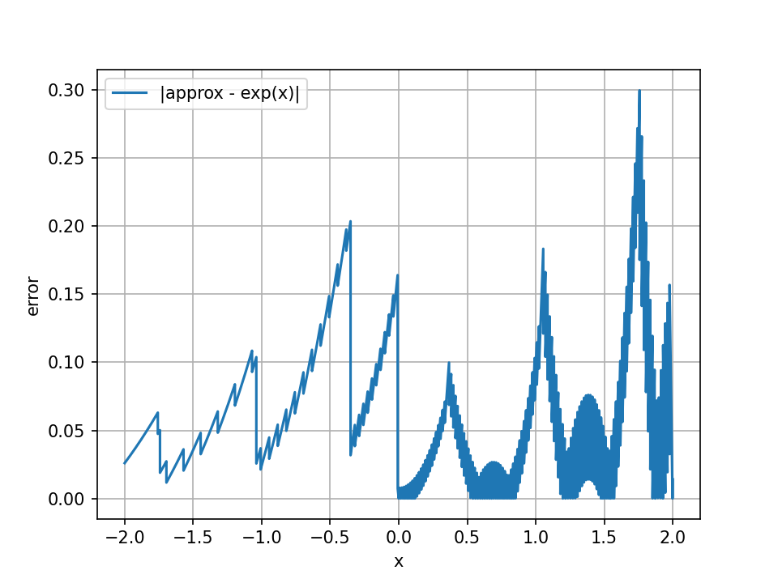

   

# Tiny Tapeout Verilog Project Template

- [Read the documentation for project](docs/info.md)

## What is Tiny Tapeout?

Tiny Tapeout is an educational project that aims to make it easier and cheaper than ever to get your digital and analog designs manufactured on a real chip.

To learn more and get started, visit https://tinytapeout.com.

## Set up your Verilog project

1. Add your Verilog files to the `src` folder.
2. Edit the [info.yaml](info.yaml) and update information about your project, paying special attention to the `source_files` and `top_module` properties. If you are upgrading an existing Tiny Tapeout project, check out our [online info.yaml migration tool](https://tinytapeout.github.io/tt-yaml-upgrade-tool/).
3. Edit [docs/info.md](docs/info.md) and add a description of your project.
4. Adapt the testbench to your design. See [test/README.md](test/README.md) for more information.

The GitHub action will automatically build the ASIC files using [LibreLane](https://www.zerotoasiccourse.com/terminology/librelane/).

## Enable GitHub actions to build the results page

- [Enabling GitHub Pages](https://tinytapeout.com/faq/#my-github-action-is-failing-on-the-pages-part)

## Resources

- [FAQ](https://tinytapeout.com/faq/)
- [Digital design lessons](https://tinytapeout.com/digital_design/)
- [Learn how semiconductors work](https://tinytapeout.com/siliwiz/)
- [Join the community](https://tinytapeout.com/discord)
- [Build your design locally](https://www.tinytapeout.com/guides/local-hardening/)

## What next?

- [Submit your design to the next shuttle](https://app.tinytapeout.com/).
- Edit [this README](README.md) and explain your design, how it works, and how to test it.
- Share your project on your social network of choice:
  - LinkedIn [#tinytapeout](https://www.linkedin.com/search/results/content/?keywords=%23tinytapeout) [@TinyTapeout](https://www.linkedin.com/company/100708654/)
  - Mastodon [#tinytapeout](https://chaos.social/tags/tinytapeout) [@matthewvenn](https://chaos.social/@matthewvenn)
  - X (formerly Twitter) [#tinytapeout](https://twitter.com/hashtag/tinytapeout) [@tinytapeout](https://twitter.com/tinytapeout)
  - Bluesky [@tinytapeout.com](https://bsky.app/profile/tinytapeout.com)

# Transformer Attention Engine – TinyML ASIC Project

## Project Proposal

Goal: design, train, and implement the **core attention mechanism** of a Transformer model as a TinyTapeout ASIC.

We will:
1. Design a fixed-point, single-head Transformer Attention Engine in Verilog.
2. Train a small Transformer model in software for a simple sequence or classification task.
3. Extract the learned matrices (`W_Q`, `W_K`, `W_V`) from training.
4. Implement the learned weights directly in hardware using standard cells.
5. If the design exceeds area limits, reduce precision or dimensions. If still too large, explore custom cells.

---

## What the Transformer Does

A Transformer processes sequences using **self-attention** instead of recurrence or convolution.  
For input tokens \(X = [x_1, x_2, ..., x_n]\):

\[
Q = XW_Q,\quad K = XW_K,\quad V = XW_V
\]
\[
\text{Attention}(Q,K,V) = \text{softmax}\!\left(\frac{QK^T}{\sqrt{d_k}}\right)V
\]

Each token attends to all others through this computation.

---

## Hardware Implementation

- Function: \(O = \text{softmax}(QK^T)V\)
- Precision: 8-bit fixed point
- Dimensions: \(d_k = 4, d_v = 1, n = 4\)
- Architecture: serialized, single 8×8→16-bit MAC
- Softmax: LUT-based exponential and reciprocal
- Technology: Sky130 open PDK (TinyTapeout)
- Target: ≤ 1k gates, 10–20 MHz

---

## Implementation Plan (Condensed)

1. **Interface**  
   Define ports: `clk, rst_n, in_data[7:0], in_valid, in_ready, out_data[7:0], out_valid, out_ready`.

2. **Golden Reference**  
   Python fixed-point model, LUT generation (`exp_lut.mem`, `recip_lut.mem`), test vectors.

3. **RTL Core**  
   Modules: `mac8x8.sv`, `lut_exp.sv`, `lut_recip.sv`, `fifo2.sv`, `attn_fsm.sv`.  
   FSM stages: SCORE → SOFTMAX → NORM → WEIGHTED_SUM → OUT.

4. **Simulation**  
   Unit testbenches, full verification vs. Python golden (±1 LSB).

5. **Synthesis**  
   Run `yosys`, reduce LUTs if over area, verify timing.

6. **Integration**  
   TinyTapeout repo structure:  


# How to do it
Range-reduction + **polynomials** + a **Newton reciprocal**. Below is a compact, hardware-friendly design for **dmodel=4**, ≤4 tokens, **int8 Q/K (−128…127)**, computing one row at a time.

---

# Numeric setup (no max-sub, no LUTs)

* **Q, K:** int8 symmetric, interpret as /64 → (s_q = s_k = 2^{-6}).
* **Score (per logit):** (\sum_{t=0}^{3} q_t k_t). Worst case (4·127·127=64{,}516).
  Use **≥20-bit signed** accumulator.
* **Scaled dot:** divide by (\sqrt{d_k}=2) → arithmetic `>>>1`.
* **Logit fixed-point:** treat result as **Q4.13** and **clamp** to ([-8, +8]):

  * `X_MIN = -8 << 13`, `X_MAX = +8 << 13`.

This bounds the exp input and gives you 13 fractional bits (fine precision).

---

# Softmax row pipeline (no LUTs)

## 1) Scores → logits (Q4.13)

```verilog
acc[j] = Σ q[i,t]*k[j,t];           // 20b signed
x[j]   = clamp( acc[j] >>> 1, X_MIN, X_MAX );   // Q4.13
```

## 2) e^x with **range-reduction + polynomial** (no table)

We use (x = n\ln2 + r) with **n integer** and **r in ([-\tfrac{\ln2}{2}, +\tfrac{\ln2}{2}])**, so
[
e^{x} = 2^{n},e^{r}.
]

**Steps (fixed-point):**

1. Convert Q4.13 logit (x) to **u = x/ln2** using a fixed multiplier:
   `INV_LN2_Q16 = round((1/ln2)·2^16) = 94447`.
   `u = (x * INV_LN2_Q16) >> 16`  // u is Q4.13
2. Choose **n = round(u)** (round to nearest keeps r small).
   `n = (u + 0.5) floor` implemented as add (2^{(−FRAC)}) before trunc.
3. Remainder in “natural base” domain:
   `r = x - n*LN2_Q13`, with `LN2_Q13 = round(ln2·2^13) = 5675`.
   Now (r \in [-0.3466, +0.3466]) (nice and small).
4. **Polynomial for (e^{r})** on that tiny interval (Horner form, Q0.16):
   Use the truncated Maclaurin (good here) — constants in **Q0.16**:

   * (1) → `1_Q16 = 65536`
   * (1) → (coefficient of r)
   * (1/2) → `32768`
   * (1/6) → `10923`
   * (1/24) → `2731` (optional quartic term)

   Evaluate:

   ```verilog
   // r is Q4.13; convert to Q0.16: r16 = r << (16-13) = r << 3
   t  = r16;                            // Q0.16
   p  = 2731;                           // = 1/24 in Q0.16 (optional)
   p  = p * t >> 16;  p += 10923;       // + 1/6, Q0.16
   p  = p * t >> 16;  p += 32768;       // + 1/2
   p  = p * t >> 16;  p += 65536;       // + 1
   p  = p * t >> 16;  p += 65536;       // + r term (coefficient = 1)
   // p ≈ e^r in Q0.16
   ```

   For minimal gates you can drop the quartic (use up to r^3): error stays tiny because |r|≤0.35.
5. Apply (2^n) by **shifts**:

   ```verilog
   // scale p (Q0.16) by 2^n
   e[j] = (n>=0) ? sat16(p << n) : (p >> (-n));  // keep Q0.16
   ```

> This uses only multipliers/adders/shifts and a few **constants** — no tables.

## 3) Sum + **reciprocal without LUT** (seed + Newton)

* Sum exponentials: `Z = e0 + e1 + e2 + e3` in **Q3.16**.
* **Normalize** Z into ([0.5,1)) by shifting: find shift `s` so that `Z1 = Z << s` (or `>>`) lands in that interval (use a leading-one detector). Track `s`.
* **Magic linear seed** for (1/z) on ([0.5,1)) (no LUT):
  [
  R_0 \approx \frac{48}{17} - \frac{32}{17},Z_1.
  ]
  Constants (Q0.16):
  `C = round((48/17)*2^16) = 185043`,
  `D = round((32/17)*2^16) = 123362`.

  ```verilog
  R0 = C - ((D * Z1) >> 16);         // Q0.16
  ```
* **One Newton step** (Q0.16) gives ~14–16 effective bits:

  ```verilog
  T  = (Z1 * R0) >> 16;              // Q0.16
  R1 = (R0 * ( (2<<16) - T )) >> 16; // Q0.16
  ```
* Undo normalization: if Z was scaled by (2^{s}) to make Z1, then (1/Z = R1 / 2^{s}) → shift:

  ```verilog
  R = (s>=0) ? (R1 >> s) : (R1 << (-s));   // Q0.16
  ```

## 4) Weights

```verilog
a[j] = (e[j] * R) >> 16;     // Q0.16
// a[0]+a[1]+a[2]+a[3] ≈ 1.0 (tiny rounding error)
```

That’s your **softmax row** with **zero LUTs**.

---

## If you also need **ln(x)** (no LUT)

Normalize (y) (Q0.16) to (y = m·2^k) with (m∈[1,2)). Then:
[
\ln y = k\ln 2 + \ln m,\quad \text{with } m=1+t,; t∈[0,1).
]
Use a short polynomial for (\ln(1+t)) (Horner, Q0.16):
[
\ln(1+t)\approx t - \tfrac{1}{2}t^2 + \tfrac{1}{3}t^3 - \tfrac{1}{4}t^4.
]
Coeffs in Q0.16:
`+1` = 65536, `−1/2` = −32768, `+1/3` = 21845, `−1/4` = −16384.
Then:

```verilog
t = m - (1<<16);             // Q0.16, since m in [1,2)
p = -16384;                  // -1/4
p = (p*t >> 16) + 21845;     // +1/3
p = (p*t >> 16) - 32768;     // -1/2
p = (p*t >> 16) + 65536;     // +1
ln_m = (p*t) >> 16;          // Q0.16
ln_y = ln_m + k * LN2_Q16;   // LN2_Q16=45426
```

(If you want tighter error, first fold (m) into ([\sqrt{2}/2, \sqrt{2})) by optionally shifting an extra 1 and adjusting k; this centers t around 0.)

---

## Notes on precision & cost

* **No LUTs**: only constant multipliers/adders/shifters.
* **exp**: Range-reduced cubic (or quartic) on (|r|≤0.3466) gives very small error (≪1e−3 abs).
* **1/Z**: the linear magic seed + one Newton step typically yields ~15 bits of accuracy.
* For extra robustness (since you skip max-sub), optionally **cool the logits** by 1 bit: `x >>= 1` → range ±4; makes saturation impossible and often improves stability.

---

### Constants (ready to use)

* `INV_LN2_Q16 = 94447`  // 1/ln2
* `LN2_Q13    = 5675`    // ln2 in Q4.13
* `LN2_Q16    = 45426`   // ln2 in Q0.16
* Poly (Q0.16): `1=65536`, `1/2=32768`, `1/6=10923`, `1/24=2731`
* Reciprocal seed (Q0.16): `C=185043`, `D=123362`


## Inputs should be quantized from -1 to 1 (Q0.7) 8 bits
## MAC output (dmodel, L = 4) gives scores -2<si<2, (Q1.15) 17 bits
## We take just Q1.6 as input to e^xe^x range is 0<e^si<e^2 = 7.389 (UQ3.7) 10 bits -> 2^-7 ~ e^-4 error
## e^x approximation error plot
